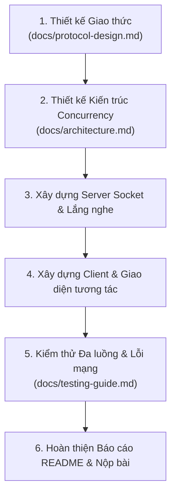

# Hướng dẫn Bắt đầu (Getting Started Guide)

> 📌 **Lưu ý**: File này hướng dẫn cách sử dụng starter template và triển khai đồ án. Khi hoàn tất đồ án, tài liệu chính thức của nhóm bạn sẽ được cập nhật trong [`README.md`](README.md).

---

## 1. Yêu cầu Tiên quyết (Prerequisites)

- [Git](https://git-scm.com/downloads) (bắt buộc)
- [Docker Desktop](https://www.docker.com/products/docker-desktop/) (khuyến nghị cho môi trường đồng nhất giữa các thành viên)
- Một công cụ AI Coding hỗ trợ:
  - [Google Gemini / Antigravity](https://cloud.google.com/)
  - [Cursor IDE](https://cursor.com/)
  - [GitHub Copilot](https://github.com/features/copilot)
  - [Claude Code](https://docs.anthropic.com/en/docs/claude-code)
  - [Windsurf](https://codeium.com/windsurf)

---

## 2. Quy trình Khởi động Nhanh (Quick Start)

### Bước 1: Fork Repository
1. Truy cập repo gốc: [https://github.com/hungdn1701/network-programming-starter](https://github.com/hungdn1701/network-programming-starter)
2. Bấm nút **Fork** ở góc trên bên phải để tạo bản sao về tài khoản GitHub của nhóm/cá nhân bạn.
   *(Quy trình Fork giúp giảng viên theo dõi được đồ án và các nhóm có thể cập nhật thay đổi nếu repo gốc có bản vá).*

### Bước 2: Clone về máy
```bash
git clone https://github.com/<YOUR-USERNAME>/network-programming-starter.git
cd network-programming-starter
```

### Bước 3: Khởi tạo môi trường
Chạy lệnh khởi tạo để tạo file `.env` từ `.env.example`:
```bash
make init
# Hoặc chạy trực tiếp trên Windows PowerShell / Bash:
# cp .env.example .env
```

### Bước 4: Kiểm tra và Chạy thử
```bash
# Khởi động toàn bộ dịch vụ (Server + Client)
make up
# Hoặc: docker compose up --build
```

---

## 3. Lựa chọn Công nghệ & Cấu hình Dockerfile

Template này là **Technology-Agnostic** (không áp đặt công nghệ). Dưới đây là hướng dẫn cấu hình mẫu cho 4 ngôn ngữ phổ biến nhất trong môn Lập trình mạng:

### ☕ Cách 1: Java (Socket / ServerSocket truyền thống hoặc NIO)

**`server/Dockerfile`:**
```dockerfile
FROM eclipse-temurin:21-jdk-alpine AS build
WORKDIR /app
COPY src/ ./src/
RUN javac -d bin src/*.java

FROM eclipse-temurin:21-jre-alpine
WORKDIR /app
COPY --from=build /app/bin ./bin
EXPOSE 5000
CMD ["java", "-cp", "bin", "Server"]
```

**`client/Dockerfile`:**
```dockerfile
FROM eclipse-temurin:21-jdk-alpine
WORKDIR /app
COPY src/ ./src/
RUN javac -d bin src/*.java
CMD ["java", "-cp", "bin", "Client"]
```

---

### 🐍 Cách 2: Python (socket / asyncio)

**`server/Dockerfile`:**
```dockerfile
FROM python:3.11-slim
WORKDIR /app
COPY requirements.txt* ./
RUN if [ -f requirements.txt ]; then pip install --no-cache-dir -r requirements.txt; fi
COPY src/ ./src/
EXPOSE 5000
CMD ["python", "src/server.py"]
```

**`client/Dockerfile`:**
```dockerfile
FROM python:3.11-slim
WORKDIR /app
COPY requirements.txt* ./
RUN if [ -f requirements.txt ]; then pip install --no-cache-dir -r requirements.txt; fi
COPY src/ ./src/
CMD ["python", "src/client.py"]
```

---

### ⚡ Cách 3: C/C++ (POSIX Sockets / Winsock)

**`server/Dockerfile`:**
```dockerfile
FROM gcc:13 AS build
WORKDIR /app
COPY src/ ./src/
RUN gcc -O2 -pthread -o server src/server.c

FROM ubuntu:22.04
WORKDIR /app
COPY --from=build /app/server .
EXPOSE 5000
CMD ["./server"]
```

---

### 🟢 Cách 4: Node.js / TypeScript (net / dgram module)

**`server/Dockerfile`:**
```dockerfile
FROM node:20-alpine
WORKDIR /app
COPY package*.json ./
RUN npm install
COPY src/ ./src/
EXPOSE 5000
CMD ["node", "src/server.js"]
```

---

## 4. Quy tắc Mạng & Giao tiếp trong Docker

> ⚠️ **Lỗi phổ biến nhất của sinh viên**:
> 1. **Lắng nghe sai địa chỉ ở Server**: Trong container, Server PHẢI bind vào `0.0.0.0` (tất cả các card mạng), **KHÔNG ĐƯỢC** bind vào `127.0.0.1` hay `localhost`. Nếu bind vào `127.0.0.1`, Client từ bên ngoài container sẽ không thể kết nối tới!
> 2. **Client kết nối sai địa chỉ**:
>    - Khi Client chạy **trong container Docker**: kết nối tới hostname `server` (nhờ Docker DNS nội bộ), cổng `5000`.
>    - Khi Client chạy **trực tiếp ngoài máy Host**: kết nối tới `localhost:5000`.

Biến môi trường trong `.env`:
```ini
SERVER_HOST=0.0.0.0
SERVER_PORT=5000

CLIENT_TARGET_HOST=server
CLIENT_TARGET_PORT=5000
```

---

## 5. Các Lệnh Tiện ích (Makefile)

| Lệnh | Ý nghĩa |
|---|---|
| `make init` | Tạo file `.env` từ `.env.example` |
| `make up` | Build và chạy các container dưới nền |
| `make down` | Dừng toàn bộ container và giải phóng mạng |
| `make logs` | Xem stream log của Server và Client |
| `make server-logs` | Chỉ xem log của riêng Server |
| `make client-run` | Chạy 1 instance Client có giao diện tương tác (interactive CLI) |
| `make server-shell`| Mở terminal bash/sh trực tiếp bên trong container Server |
| `make clean` | Xóa các image và container tạm thời |

---

## 6. Lộ trình Triển khai Đồ án (Workflow)



---

## 7. Danh mục Kiểm tra Nộp bài (Submission Checklist)

Trước khi nộp bài và bảo vệ, hãy kiểm tra lần lượt:

- [ ] **Nhận diện**: Cập nhật đầy đủ họ tên, MSSV, lớp, tỷ lệ đóng góp trong [`README.md`](README.md).
- [ ] **Tài liệu giao thức**: Hoàn thiện [`docs/protocol-design.md`](docs/protocol-design.md) có đầy đủ định dạng thông điệp, danh sách mã lệnh và sơ đồ trao đổi.
- [ ] **Khởi chạy độc lập**: Kiểm tra trên máy mới: chỉ cần gõ `docker compose up --build` là Server khởi động thành công và sẵn sàng nhận kết nối.
- [ ] **Không hardcode IP/Port**: Toàn bộ cấu hình mạng được đọc từ biến môi trường (`.env`).
- [ ] **Xử lý ngắt kết nối an toàn**: Server không bị crash (văng lỗi Exception không bắt) khi Client bất ngờ tắt ứng dụng (`Ctrl+C` hoặc rớt mạng).
- [ ] **Giải phóng tài nguyên**: Socket, File Descriptor, Thread pool được đóng đúng quy trình (Graceful Shutdown).
