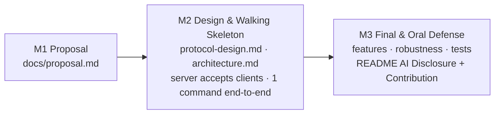

# Getting Started

> This file explains **how to use this starter**. It is not part of your deliverable — your project report is [`README.md`](README.md).
> Rules and grading: [`INSTRUCTION.md`](INSTRUCTION.md).

---

## 1. Prerequisites

| Tool | Check | Install |
|------|-------|---------|
| Git | `git --version` | https://git-scm.com/downloads |
| Docker Desktop (includes Compose v2) | `docker compose version` | https://docs.docker.com/get-docker/ |
| An AI coding assistant (optional) | — | See [`.ai/ai-guide.md`](.ai/ai-guide.md) |

> On Windows, start Docker Desktop and wait for the 🐳 icon before running any `docker` command.
> No Docker on your machine? Open the repo in **GitHub Codespaces** — the `.devcontainer/` is pre-configured.

---

## 2. Team Repository

First-time setup — GitHub account, star & fork, the private team repository created by the LMS, cloning, your first
pull request and getting starter updates — is described step by step in
[`docs/student-guide.md`](docs/student-guide.md). **Read it first.**

---

## 3. Run It

```bash
make up          # build and start the server in the background  (docker compose up --build -d)
make logs        # follow server logs
make client      # start an interactive client (repeat in more terminals)  (docker compose run --rm client)
make smoke       # quick check: is the server accepting TCP connections?
make down        # stop everything
```

The server and client Dockerfiles are placeholders until you choose a language (next section).

### Networking rules inside Docker

| Who | Must use | Why |
|-----|----------|-----|
| Server (in container) | bind `SERVER_HOST=0.0.0.0` | `127.0.0.1` inside a container is unreachable from other containers |
| Client in a container | connect to `server:5000` | Docker Compose DNS resolves service names |
| Client running natively on your machine | connect to `localhost:5000` | port 5000 is published to the host |

All values come from `.env` (`SERVER_HOST`, `SERVER_PORT`, `CLIENT_TARGET_HOST`, `CLIENT_TARGET_PORT`).

---

## 4. Choose a Language — Dockerfile Examples

Replace `server/Dockerfile` and `client/Dockerfile` with one of these (adapt file names).

<details>
<summary><b>Java</b> (Socket / ServerSocket or NIO)</summary>

```dockerfile
# server/Dockerfile
FROM eclipse-temurin:21-jdk-alpine AS build
WORKDIR /app
COPY src/ ./src/
RUN javac -d bin $(find src -name "*.java")

FROM eclipse-temurin:21-jre-alpine
WORKDIR /app
COPY --from=build /app/bin ./bin
EXPOSE 5000
CMD ["java", "-cp", "bin", "Server"]
```
Client: same pattern, `CMD ["java", "-cp", "bin", "Client"]`.
</details>

<details>
<summary><b>Python</b> (socket / asyncio)</summary>

```dockerfile
# server/Dockerfile
FROM python:3.12-slim
WORKDIR /app
COPY requirements.txt* ./
RUN if [ -f requirements.txt ]; then pip install --no-cache-dir -r requirements.txt; fi
COPY src/ ./src/
EXPOSE 5000
CMD ["python", "-u", "src/server.py"]
```
Client: same pattern, `CMD ["python", "-u", "src/client.py"]`. (`-u` = unbuffered output, so logs appear immediately.)
</details>

<details>
<summary><b>C / C++</b> (POSIX sockets, pthreads)</summary>

```dockerfile
# server/Dockerfile
FROM gcc:14 AS build
WORKDIR /app
COPY src/ ./src/
RUN gcc -O2 -pthread -o server src/*.c

FROM debian:bookworm-slim
WORKDIR /app
COPY --from=build /app/server .
EXPOSE 5000
CMD ["./server"]
```
</details>

<details>
<summary><b>Node.js</b> (net / dgram)</summary>

```dockerfile
# server/Dockerfile
FROM node:22-alpine
WORKDIR /app
COPY package*.json ./
RUN npm ci --omit=dev || npm install --omit=dev
COPY src/ ./src/
EXPOSE 5000
CMD ["node", "src/server.js"]
```
</details>

<details>
<summary><b>Go</b> (net)</summary>

```dockerfile
# server/Dockerfile
FROM golang:1.23-alpine AS build
WORKDIR /app
COPY src/ ./
RUN go build -o /server .

FROM alpine:3.20
COPY --from=build /server /server
EXPOSE 5000
CMD ["/server"]
```
</details>

Using `shared/` code in both images? Change the build context to the repo root in `docker-compose.yml`
(`build: { context: ., dockerfile: server/Dockerfile }`) and `COPY shared/ ./shared/`.

---

## 5. Workflow by Milestone



| Milestone | Checklist |
|-----------|-----------|
| **M1 — Proposal** | ☐ Team table + pitch in README ☐ `docs/proposal.md` complete ☐ ownership plan agreed |
| **M2 — Design & Skeleton** | ☐ `docs/protocol-design.md` (framing, messages, commands, status codes, sequence diagrams, rationale) ☐ `docs/architecture.md` (concurrency model + shared state) ☐ server accepts several clients in Docker ☐ one command works end-to-end |
| **M3 — Final** | ☐ all features ☐ robustness tests in `docs/testing-guide.md` ☐ README complete |

**Log AI usage as you go** in [`docs/ai-log.md`](docs/ai-log.md) — two minutes after each significant session is far easier than reconstructing it the night before the deadline.

---

## 6. Team Git Workflow

```
main  ← protected by convention: merge via Pull Requests only
 ├── feature/protocol-parser     (member 1)
 ├── feature/session-manager     (member 2)
 └── feature/cli-client          (member 3)
```

1. `git checkout -b feature/<short-name>`
2. Commit small and often, with meaningful messages, **from your own account**.
3. Open a Pull Request — the PR template asks how you tested it and whether AI was used.
4. Another member reviews, then merge.

Your PRs and commits are the evidence for the **Contribution** table and for your oral-defense questions.

---

## 7. Useful Commands

| Command | Meaning |
|---------|---------|
| `make init` | Create `.env` from `.env.example` |
| `make up` | Build and start the server in the background |
| `make client` | Run one interactive client container |
| `make logs` | Follow logs of all running containers |
| `make smoke` | Check that the server accepts TCP connections |
| `make server-shell` | Shell inside the running server container |
| `make down` | Stop and remove containers |
| `make clean` | Remove containers, volumes and built images |

---

## Submission Checklist

Before the deadline:

- [ ] **README:** Team, Problem & Idea, Architecture, Quick Start, Demo evidence — filled in, no template placeholders left.
- [ ] **AI Disclosure** (README §8) and [`docs/ai-log.md`](docs/ai-log.md) complete.
- [ ] **Contribution** table complete and **confirmed by every member**.
- [ ] `docs/proposal.md`, `docs/protocol-design.md`, `docs/architecture.md`, `docs/testing-guide.md` complete and consistent with the code.
- [ ] Clean start works: `docker compose down -v && docker compose up --build`.
- [ ] No hard-coded IPs/ports — everything from `.env`; `.env.example` lists every variable.
- [ ] Server survives `Ctrl+C` / `kill -9` of a client and malformed input.
- [ ] Sockets, threads and file descriptors are released (graceful shutdown).
- [ ] Every member can explain every part they claim — see the self-check in [`.ai/ai-guide.md`](.ai/ai-guide.md#4-prepare-for-the-oral-defense).
