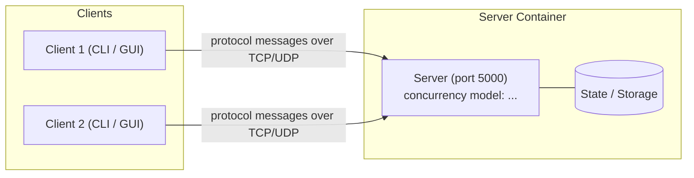

# Project Name

> **Course:** Network Programming (INT1433) · PTIT · Instructor: Dr. Hung N. Dang
>
> *One-sentence pitch: what your system does and for whom.*

📜 Assignment brief & grading: [`INSTRUCTION.md`](INSTRUCTION.md) · 🚀 Setup & workflow: [`GETTING_STARTED.md`](GETTING_STARTED.md)

> **Template note:** replace every *(italic placeholder)* below. Sections marked **(mandatory)** are required for grading.

---

## 1. Team (mandatory)

| # | Full name | Student ID | Class | GitHub | Role |
|:-:|-----------|:----------:|:-----:|--------|------|
| 1 | | | | @ | |
| 2 | | | | @ | |
| 3 | | | | @ | |

**Topic:** *(e.g., Multi-room chat over TCP)*

---

## 2. Problem & Idea (mandatory)

- **Problem:** *(What problem are you solving? Who has it?)*
- **Our idea:** *(Your solution in 2–3 sentences.)*
- **What makes it non-trivial:** *(The networking challenge — e.g., resuming transfers, real-time sync, fairness under load.)*
- **Out of scope:** *(What you deliberately do not build.)*

Full proposal: [`docs/proposal.md`](docs/proposal.md)

---

## 3. Features

- [ ] **Connection & session:** *(handshake, authentication, ...)*
- [ ] **Custom protocol:** specified in [`docs/protocol-design.md`](docs/protocol-design.md)
- [ ] **Concurrency:** many clients at once, thread-safe shared state
- [ ] **Robustness:** abrupt disconnects, malformed messages, timeouts
- [ ] **Feature A:** *(short description)*
- [ ] **Feature B:** *(short description)*

---

## 4. Architecture



| Aspect | Our choice | Why (one line) |
|--------|-----------|----------------|
| Language | | |
| Transport | TCP / UDP | |
| Framing | delimiter / length-prefix / fixed | |
| Concurrency model | thread-per-client / thread pool / event loop | |

Details: [`docs/architecture.md`](docs/architecture.md)

---

## 5. Quick Start

```bash
cp .env.example .env          # or: make init
docker compose up --build -d  # start the server   (or: make up)
docker compose run --rm client  # start a client — repeat in more terminals (or: make client)
docker compose down           # stop everything    (or: make down)
```

*(Add any extra steps, e.g., running a GUI client natively.)*

---

## 6. Demo & Test Evidence

*(Screenshots or terminal output of: several clients at once, abrupt disconnect handling, your concurrency test.
Put images in `docs/asset/`. Full results: [`docs/testing-guide.md`](docs/testing-guide.md).)*

---

## 7. Documentation

| Document | Content |
|----------|---------|
| [`docs/proposal.md`](docs/proposal.md) | M1 — problem, idea, scope, plan |
| [`docs/protocol-design.md`](docs/protocol-design.md) | Application-layer protocol specification |
| [`docs/architecture.md`](docs/architecture.md) | Concurrency model, components, connection lifecycle |
| [`docs/testing-guide.md`](docs/testing-guide.md) | Test methods and our test evidence |
| [`docs/ai-log.md`](docs/ai-log.md) | AI usage log |

---

## 8. AI Disclosure (mandatory)

> Policy: [`INSTRUCTION.md` §7](INSTRUCTION.md#7-ai-usage-policy). Disclosing AI use never lowers your score — hiding it does.

### 8.1 Summary

| Tool / model | Used by | Used for | Files / modules | Level |
|--------------|---------|----------|-----------------|-------|
| *(e.g., Claude)* | *(member)* | *(e.g., draft protocol table, review locking code)* | *(paths)* | *(Assist / Co-write / Generated)* |

**Levels:** **Assist** — explanations, suggestions, review; we wrote the code. **Co-write** — AI drafted parts, we
substantially rewrote. **Generated** — AI wrote most of it; we reviewed, tested and can explain it.

### 8.2 Decisions we made ourselves

*(Key design decisions made by the team, possibly after comparing AI-suggested options. E.g., "Chose length-prefixed
framing over newline-delimited because file chunks may contain `\n`.")*

### 8.3 Where AI was wrong — and how we found out

*(At least one concrete example: a bug, wrong assumption or bad design from AI, and how you detected and fixed it.)*

### 8.4 Full log

See [`docs/ai-log.md`](docs/ai-log.md).

---

## 9. Contribution (mandatory)

| Member | Owns (modules / documents) | Key PRs / commits | AI-assisted parts | Contribution % |
|--------|----------------------------|-------------------|-------------------|:--------------:|
| | *(e.g., `server/src/session/`, `docs/architecture.md`)* | *(e.g., #3, #7)* | *(e.g., protocol parser — Co-write)* | |
| | | | | |
| | | | | |

We confirm the table above is accurate and agreed by all members:

- [ ] Member 1
- [ ] Member 2
- [ ] Member 3

---

<sub>Based on the [network-programming-starter](https://github.com/hungdn1701/network-programming-starter) template by Hung N. Dang.</sub>
