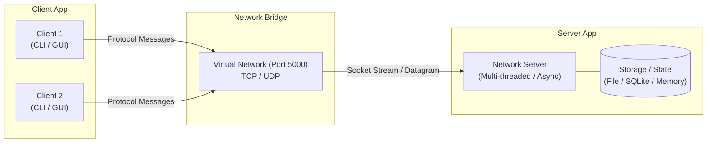

# Mẫu Đồ án: Lập trình mạng (INT1433)

[](https://github.com/hungdn1701/network-programming-starter/stargazers)
[](https://github.com/hungdn1701/network-programming-starter/network/members)
[](LICENSE)

> **Môn học**: Lập trình mạng (INT1433)  
> **Giảng viên**: Hung N. Dang (Đặng Ngọc Hùng) — PTIT  
> **Template**: Technology-Agnostic · Docker-First · Client-Server Architecture

Kho mã nguồn mẫu (starter repository) dành cho bài tập lớn / đồ án môn **Lập trình mạng (INT1433)**.
Template này cho phép sinh viên tự do lựa chọn bất kỳ ngôn ngữ lập trình nào (Java, Python, C/C++, Go, Node.js...),
hỗ trợ đóng gói môi trường qua Docker, và tích hợp sẵn bộ quy chuẩn hỗ trợ lập trình bằng AI (Gemini, Claude, Cursor, Copilot, Windsurf).

> 📜 **Quy chế & Barem chấm điểm**: Đọc kỹ [`INSTRUCTION.md`](INSTRUCTION.md) do giảng viên ban hành trước khi làm bài.  
> 📖 **Lần đầu sử dụng repo này?** Xem [`GETTING_STARTED.md`](GETTING_STARTED.md) để biết hướng dẫn fork, thiết lập môi trường, và checklist nộp bài.

---

## 👥 Thông tin Nhóm & Đề tài

- **Tên nhóm**: Nhóm 01 — Lập trình mạng
- **Chủ đề đã đăng ký**: *(Ví dụ: Hệ thống trò chuyện đa phòng qua Socket TCP)*

| STT | Họ và tên | Mã sinh viên | Lớp | Vai trò | Tỷ lệ đóng góp |
|:---:|---|:---:|:---:|---|:---:|
| 1 | Nguyễn Văn A (Trưởng nhóm) | B22DCCN001 | D22CQCN01-B | Thiết kế giao thức, Server backend | 50% |
| 2 | Trần Thị B | B22DCCN002 | D22CQCN01-B | Giao diện Client, Kiểm thử mạng | 50% |

---

## 📝 Giới thiệu bài toán & Mục tiêu

*(Mô tả ngắn gọn từ 1–2 đoạn văn về ứng dụng mạng mà nhóm xây dựng: Bài toán giải quyết là gì? Đối tượng sử dụng? Mô hình mạng sử dụng: Chat đa phòng, Truyền nhận file P2P/Client-Server, Game mạng nhiều người chơi, Hệ thống giám sát IoT, v.v.)*

### Các tính năng chính

- [x] **Xác thực & Kết nối**: Đăng nhập, đăng ký, bắt tay thiết lập phiên kết nối.
- [ ] **Giao thức ứng dụng tùy chỉnh**: Định nghĩa đầy đủ trong [`docs/protocol-design.md`](docs/protocol-design.md).
- [ ] **Xử lý đồng thời (Concurrency)**: Hỗ trợ nhiều client kết nối và tương tác cùng lúc.
- [ ] **Truyền nhận dữ liệu tin cậy**: Kiểm soát lỗi, xử lý ngắt kết nối đột ngột (graceful disconnect).
- [ ] **Tính năng nghiệp vụ A**: *(Mô tả ngắn)*
- [ ] **Tính năng nghiệp vụ B**: *(Mô tả ngắn)*

---

## 🏗 Kiến trúc hệ thống



Chi tiết phân tích mô hình đồng thời (Concurrency model) và máy trạng thái xem tại [`docs/architecture.md`](docs/architecture.md).

---

## 🚀 Khởi chạy nhanh

### Yêu cầu tiên quyết
- [Git](https://git-scm.com/)
- [Docker Desktop](https://www.docker.com/products/docker-desktop) (khuyến nghị cho việc đóng gói và kiểm thử cô lập)
- SDK của ngôn ngữ bạn chọn (nếu chạy trực tiếp ngoài máy host)

### Các bước thực hiện

```bash
# 1. Khởi tạo cấu hình môi trường (.env)
make init
# (hoặc: bash scripts/init.sh)

# 2. Khởi chạy Server trong Docker
make up
# (hoặc: docker compose up --build -d server)

# 3. Theo dõi log Server
make logs

# 4. Khởi chạy Client kết nối vào Server
make client-run
# (hoặc: docker compose run --rm client)

# 5. Dừng hệ thống khi kết thúc
make down
```

---

## 📂 Cấu trúc thư mục

```
network-programming-starter/
├── README.md                  # Tài liệu tổng quan này (sinh viên chỉnh sửa khi nộp)
├── GETTING_STARTED.md         # Hướng dẫn chi tiết sử dụng starter template
├── Makefile                   # Các lệnh tắt phát triển nhanh
├── docker-compose.yml         # Thiết lập mạng và dịch vụ Server - Client
├── .env.example               # Mẫu biến môi trường (PORT, HOST, LOG_LEVEL)
│
├── server/                    # Ứng dụng Server
│   ├── Dockerfile             # Đóng gói Server
│   ├── README.md              # Hướng dẫn module Server
│   └── src/                   # Mã nguồn Server (Java/Python/C/C++/Node/Go)
│
├── client/                    # Ứng dụng Client
│   ├── Dockerfile             # Đóng gói Client
│   ├── README.md              # Hướng dẫn module Client
│   └── src/                   # Mã nguồn Client
│
├── shared/                    # Tài nguyên dùng chung (Protocol, DTO, Utils)
│   └── README.md
│
├── docs/                      # Tài liệu đồ án
│   ├── protocol-design.md     # Đặc tả thiết kế giao thức tầng ứng dụng
│   ├── architecture.md        # Kiến trúc client-server & concurrency
│   └── testing-guide.md       # Hướng dẫn kiểm thử mạng & tải đồng thời
│
├── .ai/                       # AI Coding Assistant Configs (Source of Truth)
│   ├── AGENTS.md              # Quy tắc chuẩn cho AI agents
│   ├── vibe-coding-guide.md   # Cẩm nang sử dụng AI hiệu quả
│   └── prompts/               # Thư viện prompt mẫu có cấu trúc
│
└── .devcontainer/             # Môi trường Cloud DevContainer (Codespaces / VS Code)
```

---

## 🤖 Hỗ trợ AI Coding

Repo được thiết lập sẵn cho các công cụ AI hiện đại:
- **Google Gemini / Antigravity**: Tự động nhận diện [`GEMINI.md`](GEMINI.md) và [`AGENTS.md`](AGENTS.md)
- **Claude Code**: Tự động nhận diện [`CLAUDE.md`](CLAUDE.md)
- **Cursor**: Quy tắc chuẩn MDC tại [`.cursor/rules/network-programming.mdc`](.cursor/rules/network-programming.mdc)
- **GitHub Copilot**: Tự động tải [`.github/copilot-instructions.md`](.github/copilot-instructions.md)
- **Windsurf**: Tự động nhận diện [`.windsurfrules`](.windsurfrules)

Xem chi tiết tại [`.ai/vibe-coding-guide.md`](.ai/vibe-coding-guide.md).
