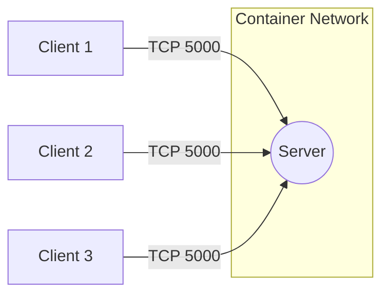

# Kiến trúc Hệ thống (Architecture)

Tài liệu này mô tả kiến trúc của hệ thống phần mềm.

## 1. Mô hình Kiến trúc
Hệ thống sử dụng mô hình Client-Server. Server hỗ trợ xử lý nhiều kết nối đồng thời sử dụng mô hình:
(Chọn một trong các mô hình dưới đây và xóa các mô hình không dùng)
- Đa luồng (Multi-threaded) - Mỗi client một luồng
- Bất đồng bộ (Asynchronous I/O)
- Đa tiến trình (Multi-process)

## 2. Sơ đồ Mạng (Network Topology)

## 3. Trách nhiệm các Thành phần (Component Responsibilities)

* **Server:**
  * Lắng nghe kết nối trên cổng chỉ định (port 5000).
  * Chấp nhận kết nối từ nhiều clients.
  * Phân tích thông điệp theo giao thức đã thiết kế.
  * Thực thi logic ứng dụng và gửi phản hồi.

* **Client:**
  * Kết nối tới Server thông qua địa chỉ IP và Cổng.
  * Cung cấp giao diện người dùng (CLI/GUI).
  * Mã hóa yêu cầu gửi đi và giải mã phản hồi nhận được.
