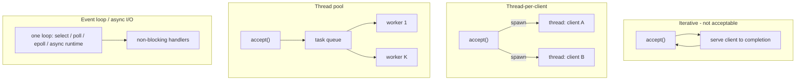
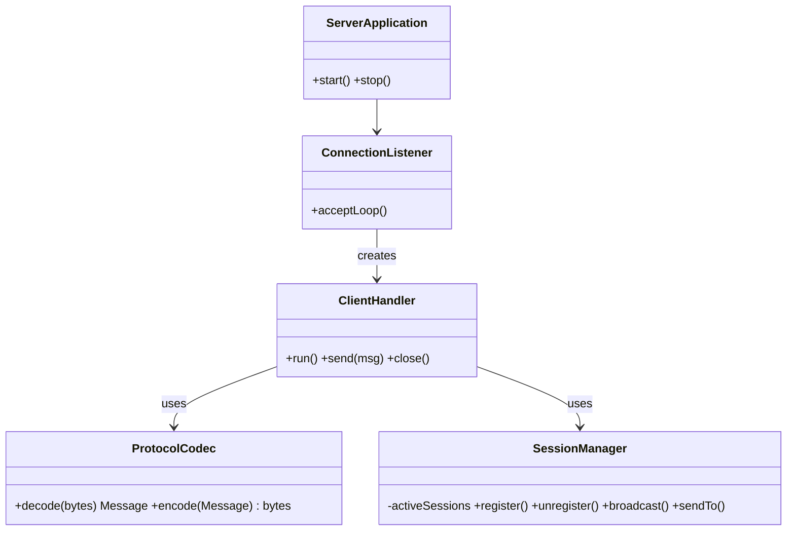
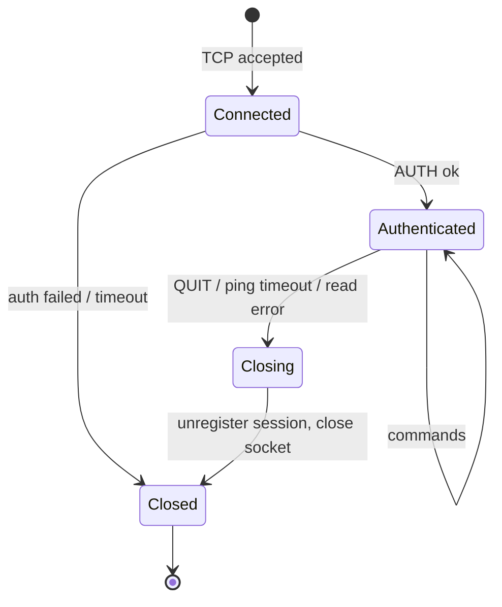

# System Architecture

> Graded under **A3 — Architecture & Concurrency Design**. Explain **what** you built and **why**.
> The diagrams below are a reference design — replace them with your own.

---

## 1. Concurrency Model

How the server serves many clients at once is the central decision of this project.

| Model | How it works | Strengths | Weaknesses | Typical tools |
|-------|-------------|-----------|------------|---------------|
| **Thread-per-client** | New thread per accepted connection; blocking I/O | Simple to write and reason about | Memory per thread; limited by OS thread count | Java `Thread`, Python `threading`, C `pthread_create` |
| **Thread pool** | Fixed K workers take tasks from a queue | Bounded resources | Clients wait when all workers are busy (with blocking I/O, K workers ≈ K clients) | Java `ExecutorService`, Python `concurrent.futures` |
| **Event loop / async I/O** | Few threads multiplex many non-blocking sockets | Scales to many connections with little memory | Harder to write; blocking calls stall everyone | Java NIO `Selector`, Python `asyncio`, Node.js, Go goroutines (runtime-managed) |

**Our model:** *(which one, and why it fits your expected load and your team)*

---

## 2. Components

| Component | Responsibility | Owner (member) |
|-----------|----------------|----------------|
| ConnectionListener | Accept connections, enforce connection limits | |
| ClientHandler | Read/write one connection, reassemble frames, dispatch commands | |
| SessionManager | Track online clients and rooms; must be thread-safe | |
| ProtocolCodec | Bytes ↔ messages (framing, serialization, validation) | |
| Client | User interface, send commands, display server pushes | |

---

## 3. Shared State & Thread Safety

List **every** piece of state accessed by more than one thread/task, and how it is protected.

| Shared state | Accessed by | Protection | Notes |
|--------------|-------------|-----------|-------|
| *(e.g., online users map)* | all handlers | *(e.g., `ConcurrentHashMap`, mutex)* | |
| *(e.g., room membership)* | | | |

Guidelines:

- Protect every read-modify-write on shared data (`synchronized`, mutex, lock, or a concurrent collection).
- If code ever holds two locks, always acquire them in the same global order (prevents deadlock).
- Do not hold a lock while doing network I/O to a client — a slow client would block everyone.
- Prefer atomics for simple flags and counters.

---

## 4. Connection Lifecycle

How does the server detect each way a connection can end (clean `QUIT`, EOF, reset, silence) and what does it clean up?

---

## 5. Deployment

| Container | Image / language | Port | Configuration |
|-----------|------------------|------|---------------|
| `server` | | 5000 | `SERVER_HOST`, `SERVER_PORT` |
| `client` | | — | `CLIENT_TARGET_HOST`, `CLIENT_TARGET_PORT` |

---

## 6. Design Decisions

| Decision | Alternatives considered | Why we chose this |
|----------|------------------------|-------------------|
| | | |
