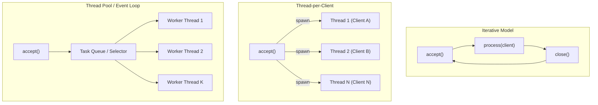
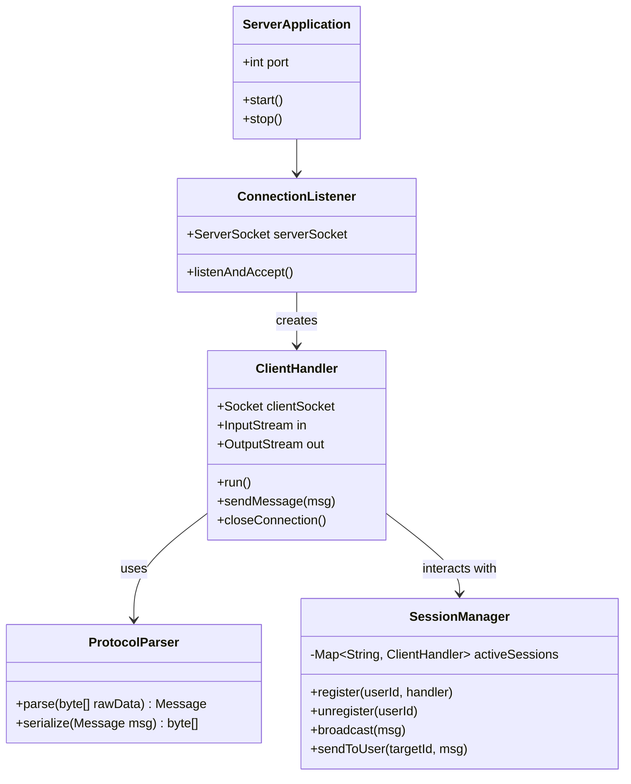
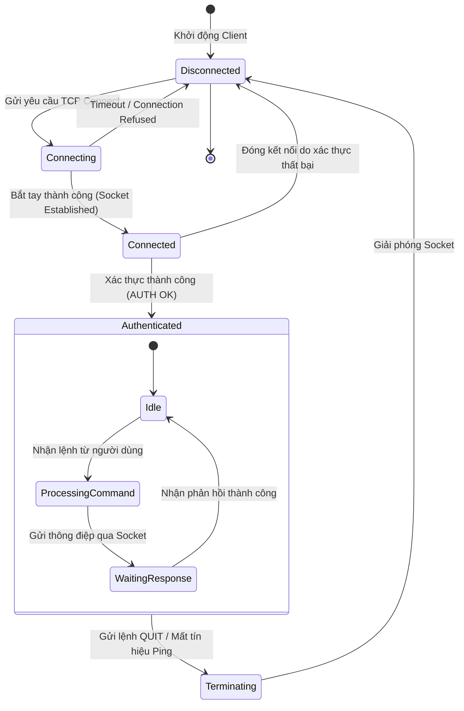

# Tài liệu Kiến trúc Hệ thống (System Architecture)

> 📌 **Tài liệu đồ án**: Lập trình mạng (INT1433)

---

## 1. Mô hình Xử lý Đồng thời tại Server (Server Concurrency Models)

Trong lập trình mạng, yếu tố quyết định hiệu năng của máy chủ là mô hình xử lý khi có hàng chục, hàng trăm client kết nối cùng lúc. Nhóm cần xác định rõ mô hình áp dụng:

### So sánh các mô hình:

| Mô hình | Cơ chế hoạt động | Ưu điểm | Nhược điểm | Ngôn ngữ / Thư viện điển hình |
|---|---|---|---|---|
| **Thread-per-Client** | Mỗi khi `accept()` 1 client mới, Server tạo 1 luồng riêng biệt để phục vụ. | Đơn giản, dễ cài đặt logic I/O chặn (blocking). | Tốn bộ nhớ stack; số lượng client bị giới hạn bởi số luồng của OS (~vài trăm luồng). | Java `new Thread()`, Python `threading.Thread`, C `pthread_create`. |
| **Thread Pool (Fixed)** | Khởi tạo sẵn K worker thread, các tác vụ được đưa vào hàng đợi (`BlockingQueue`). | Kiểm soát tối đa tài nguyên, không bị cạn kiệt RAM khi client tăng vọt. | Khi số client đồng thời vượt quá số Worker, client sau phải chờ trong hàng đợi. | Java `Executors.newFixedThreadPool()`, Python `concurrent.futures`. |
| **Non-blocking / Event-driven** | Một luồng duy nhất giám sát nhiều socket thông qua I/O Multiplexing (`select`, `poll`, `epoll`). | Xử lý hàng chục nghìn kết nối đồng thời với lượng RAM cực nhỏ. | Lập trình phức tạp; không được thực hiện tác vụ chặn CPU trong luồng chính. | Java NIO (`Selector`), Python `asyncio`, Node.js (`libuv`), Go goroutines. |

---

## 2. Kiến trúc Tổng thể & Phân rã Thành phần

### Trách nhiệm các thành phần:
1. **ConnectionListener**: Lắng nghe yêu cầu kết nối từ mạng bên ngoài, kiểm tra số lượng giới hạn kết nối.
2. **ClientHandler**: Đọc/ghi luồng byte với Client, duy trì vòng lặp nhận gói tin của từng kết nối cụ thể.
3. **SessionManager (Thread-safe)**: Quản lý danh sách các client đang trực tuyến, sử dụng cấu trúc dữ liệu an toàn đa luồng (ví dụ: `ConcurrentHashMap` trong Java hoặc Mutex Lock trong C/Python).
4. **ProtocolParser**: Chuyển đổi giữa luồng byte trên mạng và đối tượng dữ liệu trong bộ nhớ (Serialization / Deserialization).

---

## 3. Quản lý Vòng đời Kết nối (Connection Lifecycle)

---

## 4. An toàn Đa luồng (Concurrency & Thread Safety)

Khi nhiều luồng ClientHandler cùng truy cập vào bộ nhớ chia sẻ (Shared State):
1. **Tránh Deadlock**: Luôn lock tài nguyên theo một thứ tự cố định nếu cần nhiều hơn 1 lock.
2. **Tránh Race Condition**: Mọi thao tác cập nhật danh sách người dùng, số dư tài khoản, phòng chat phải được đồng bộ (`synchronized`, `Mutex`, `Semaphore`).
3. **Atomic Operations**: Ưu tiên sử dụng các biến nguyên tử (`AtomicInteger`, `AtomicBoolean`) cho các cờ trạng thái.
