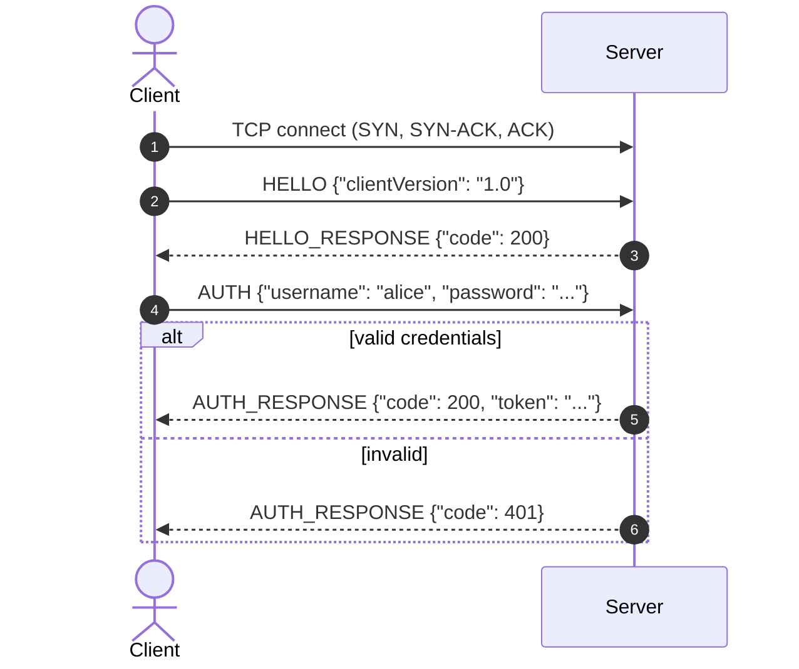
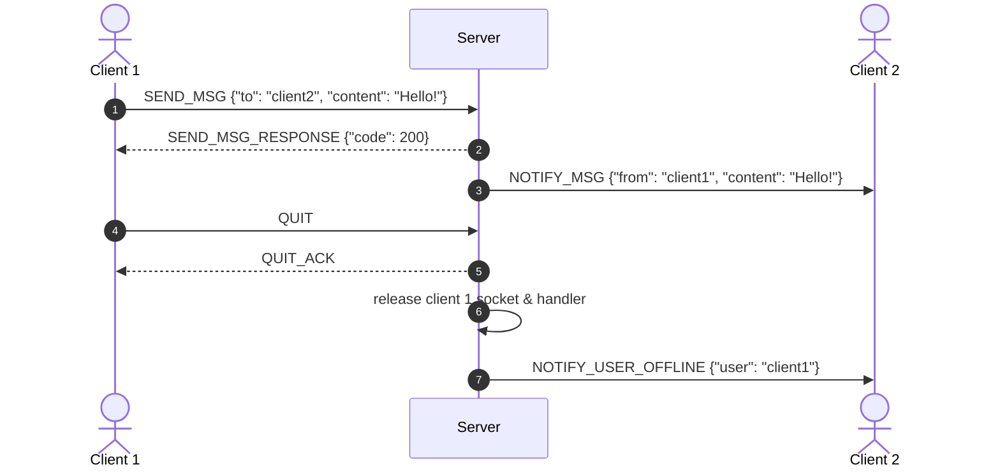

# Application Protocol Specification

> Complete this document **before** implementing a command (Milestone M2), and keep it in sync with the code.
> It is graded under **A2 — Protocol Design**: completeness *and* the reasoning behind your choices.
> The examples below are illustrations — replace them with your own protocol.

---

## 1. Overview

| Property | Our choice | Why |
|----------|-----------|-----|
| **Protocol name / version** | *(e.g., SimpleChatProtocol — SCP/1.0)* | |
| **Transport** | `TCP` / `UDP` / both | *(reliable & ordered vs. low latency & loss-tolerant)* |
| **Default port** | `5000` | |
| **Message framing** | delimiter / length-prefixed / fixed-length | *(how the receiver finds message boundaries)* |
| **Data format** | JSON / text / binary | |
| **Session model** | stateful / stateless | *(does the server remember login/session per connection?)* |
| **Character encoding** | UTF-8 | |

---

## 2. Message Framing

TCP is a **byte stream**: one `send()` may arrive as several `recv()` results, and several sends may arrive in one.
Your receiver must reassemble complete messages. Choose and describe one approach:

**Option A — Delimiter-based** (common for text/JSON): each message ends with `\n` (or `\r\n`).
The payload must never contain the delimiter (escape it, or use a format where it cannot appear).

```text
<MESSAGE>\n
```

**Option B — Length-prefixed** (works for any payload, including binary): a 4-byte big-endian length, then the payload.

```text
+-------------------+------------------------------------------+
| Length (4 bytes)  | Payload (JSON / binary / UTF-8 text)     |
+-------------------+------------------------------------------+
```

**Our framing:** *(describe it, including the maximum message size and what happens when it is exceeded)*

---

## 3. Message Format

### 3.1 Example: JSON

Request:

```json
{ "command": "ACTION_NAME", "requestId": "42", "payload": { "key": "value" } }
```

Response:

```json
{ "command": "ACTION_NAME_RESPONSE", "requestId": "42", "status": "OK", "code": 200, "message": "...", "data": {} }
```

### 3.2 Example: Plain text (SMTP / Redis style)

```text
COMMAND [ARG1] [ARG2] ...\r\n
```

e.g. `LOGIN alice secret\r\n`, `SEND bob Hello there\r\n`, `QUIT\r\n`

**Our format:** *(describe it)*

---

## 4. Command Reference

| Command | Direction | Parameters / payload | Response(s) | Description |
|---------|:---------:|----------------------|-------------|-------------|
| `HELLO` | C → S | `{"clientVersion": "1.0"}` | `HELLO_RESPONSE` | Start a session, negotiate version |
| `AUTH` | C → S | `{"username": "...", "password": "..."}` | `AUTH_RESPONSE` 200 / 401 | Log in |
| `LIST_USERS` | C → S | `{}` | `LIST_USERS_RESPONSE` | Users currently online |
| `SEND_MSG` | C → S | `{"to": "...", "content": "..."}` | 200 / 404 | Message to a user or room |
| `NOTIFY_MSG` | S → C | `{"from": "...", "content": "..."}` | — | Server pushes an incoming message |
| `PING` / `PONG` | both | `{}` | — | Keep-alive / liveness check |
| `QUIT` | C → S | `{"reason": "..."}` | `QUIT_ACK` | Close the session gracefully |

---

## 5. Status Codes & Errors

| Code | Name | Meaning |
|:----:|------|---------|
| 200 | `OK` | Success |
| 201 | `CREATED` | Resource created |
| 400 | `BAD_REQUEST` | Malformed message or missing field |
| 401 | `UNAUTHORIZED` | Not logged in / wrong credentials |
| 403 | `FORBIDDEN` | Not allowed |
| 404 | `NOT_FOUND` | Target user/resource does not exist |
| 409 | `CONFLICT` | e.g., username already online |
| 413 | `TOO_LARGE` | Message exceeds the maximum size |
| 500 | `INTERNAL_ERROR` | Unexpected server error |

**What does the server do on a malformed message?** *(reply 400 and keep the connection? close it? count strikes?)*

---

## 6. Sequence Diagrams

### 6.1 Handshake & Authentication



### 6.2 Message Exchange & Disconnect



*(Add a diagram for each important flow, including at least one error/abnormal flow.)*

---

## 7. Limits, Timeouts & Safety

| Rule | Our value | Why |
|------|-----------|-----|
| Max message size | *(e.g., 64 KB)* | Prevent memory exhaustion from garbage streams |
| Idle / read timeout | *(e.g., 90 s)* | Detect dead clients |
| Keep-alive | *(e.g., PING every 30 s)* | |
| Max clients | | |
| Authentication of sensitive commands | | |

---

## 8. Design Rationale

*(The most important section for grading. For each major choice — transport, framing, format, session model —
explain why you chose it, what alternative you rejected, and what the trade-off is.)*
