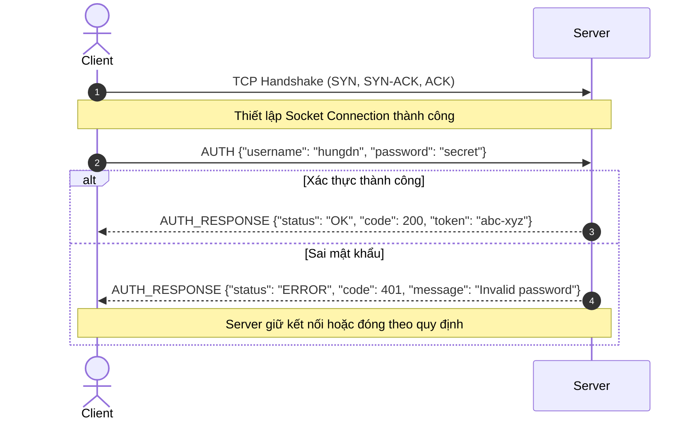
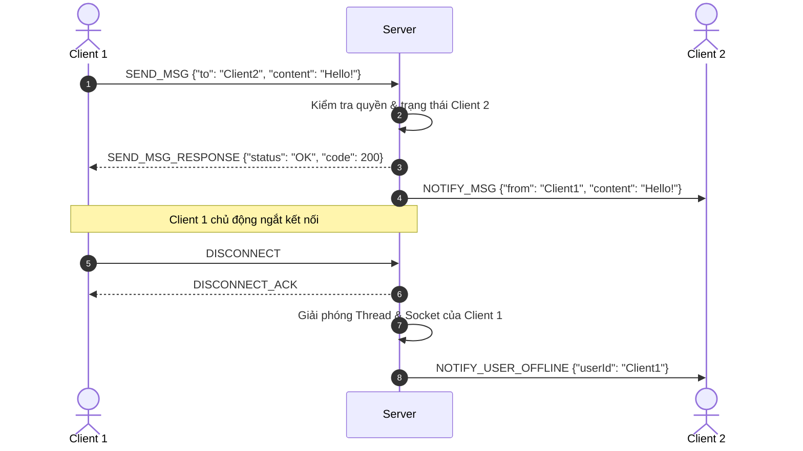

# Thiết kế Giao thức Tầng Ứng dụng (Application Protocol Specification)

> 📌 **Tài liệu đồ án môn học**: Lập trình mạng (INT1433)  
> Nhóm sinh viên cần hoàn thiện tài liệu này trước khi bắt tay vào viết mã nguồn.

---

## 1. Tổng quan Giao thức (Protocol Overview)

| Thuộc tính | Lựa chọn của nhóm | Ghi chú giải thích |
|---|---|---|
| **Tên giao thức** | *(Ví dụ: SimpleChatProtocol - SCP / v1.0)* | Tên định danh cho giao thức |
| **Giao thức vận chuyển (Transport)** | `TCP` / `UDP` | Chọn TCP (tin cậy, tuần tự) hoặc UDP (tốc độ cao, chấp nhận mất gói) |
| **Cổng mặc định (Default Port)** | `5000` | Cổng dịch vụ lắng nghe |
| **Kiểu phân tách gói tin (Message Framing)** | *Delimiter-based* / *Length-prefixed* / *Fixed-length* | Cách nhận biết ranh giới kết thúc 1 thông điệp |
| **Định dạng dữ liệu (Data Format)** | `JSON` / `Text (ASCII)` / `Binary` | Dạng chuỗi byte truyền trên đường dây |
| **Quản lý phiên (Session Model)** | `Stateful` / `Stateless` | Server có lưu trạng thái đăng nhập/phiên kết nối hay không |

---

## 2. Ranh giới Thông điệp (Message Framing)

Trong mạng TCP (Stream-oriented), luồng byte không có ranh giới tin nhắn tự nhiên. Nhóm cần chọn và mô tả cơ chế phân tách:

### Lựa chọn A: Ký tự phân tách (Delimiter-based - phổ biến cho Text/JSON)
Mỗi thông điệp kết thúc bằng ký tự xuống dòng `\n` hoặc cặp `\r\n`:
```text
[MESSAGE_CONTENT]\n
```

### Lựa chọn B: Tiền tố độ dài (Length-prefixed - chuẩn công nghiệp)
4 byte đầu chứa độ dài phần thân (Big-Endian integer), tiếp theo là dữ liệu:
```text
+-------------------+------------------------------------------+
| Length (4 bytes)  | Payload (JSON / Binary / UTF-8 Text)     |
+-------------------+------------------------------------------+
```

---

## 3. Cấu trúc Thông điệp Chuẩn (Message Format)

### 3.1. Dạng JSON (Khuyến nghị cho ứng dụng hiện đại)
```json
{
  "command": "ACTION_NAME",
  "requestId": "uuid-or-sequence-number",
  "payload": {
    "key": "value"
  }
}
```

Phản hồi từ Server:
```json
{
  "command": "ACTION_NAME_RESPONSE",
  "requestId": "uuid-or-sequence-number",
  "status": "OK", 
  "code": 200,
  "message": "Mô tả trạng thái",
  "data": { }
}
```

### 3.2. Dạng Text thuần (Kiểu SMTP / Redis / HTTP thô)
```text
COMMAND [ARG1] [ARG2] ...\r\n
```
*Ví dụ:*
- `LOGIN hungdn password123\n`
- `SEND user2 Xin chao ban\n`
- `QUIT\n`

---

## 4. Bảng Danh mục Mã lệnh (Command Reference)

Liệt kê toàn bộ các lệnh mà Client và Server có thể gửi:

| Lệnh (Command) | Hướng truyền | Tham số / Payload | Mô tả nghiệp vụ |
|---|:---:|---|---|
| `CONNECT` / `HANDSHAKE` | Client → Server | `{"clientVersion": "1.0"}` | Khởi tạo phiên kết nối |
| `AUTH` | Client → Server | `{"username": "...", "password": "..."}` | Đăng nhập tài khoản |
| `LIST_USERS` | Client → Server | `{}` | Lấy danh sách người dùng online |
| `SEND_MSG` | Client → Server | `{"to": "target_id", "content": "..."}` | Gửi tin nhắn tới cá nhân hoặc phòng |
| `BROADCAST` | Server → All | `{"from": "...", "content": "..."}` | Thông báo tới tất cả client |
| `DISCONNECT` | Client → Server | `{"reason": "User logout"}` | Chủ động đóng phiên kết nối |

---

## 5. Quy chuẩn Mã Trạng thái & Xử lý Lỗi (Status Codes)

| Mã Code | Định danh | Ý nghĩa |
|:---:|---|---|
| `200` | `OK` | Thao tác thành công |
| `201` | `CREATED` | Tạo tài nguyên mới thành công |
| `400` | `BAD_REQUEST` | Thông điệp sai cú pháp hoặc thiếu trường bắt buộc |
| `401` | `UNAUTHORIZED` | Chưa đăng nhập hoặc sai thông tin xác thực |
| `403` | `FORBIDDEN` | Không có quyền thực hiện hành động này |
| `404` | `NOT_FOUND` | Người nhận hoặc tài nguyên không tồn tại |
| `409` | `CONFLICT` | Tên người dùng hoặc phiên làm việc đã tồn tại |
| `500` | `INTERNAL_ERROR` | Lỗi ngoại lệ máy chủ |

---

## 6. Sơ đồ Tuần tự Trao đổi (Sequence Diagrams)

### 6.1. Luồng Bắt tay & Đăng nhập (Handshake & Authentication)


### 6.2. Luồng Trao đổi Dữ liệu & Xử lý Ngắt kết nối (Data Exchange & Disconnect)


---

## 7. Yêu cầu An toàn & Ràng buộc Kỹ thuật

1. **Giới hạn kích thước gói tin (Max Payload Size)**: Đặt trần kích thước (ví dụ tối đa 64 KB) để tránh tràn bộ nhớ khi client gửi stream rác.
2. **Timeout & Heartbeat (Ping/Pong)**: Gửi gói tin giữ kết nối (Keep-Alive Ping) định kỳ mỗi 30 giây; ngắt kết nối nếu quá 90 giây không nhận được phản hồi.
3. **Mã hóa ký tự**: Toàn bộ chuỗi văn bản sử dụng chuẩn mã hóa `UTF-8` không BOM.
