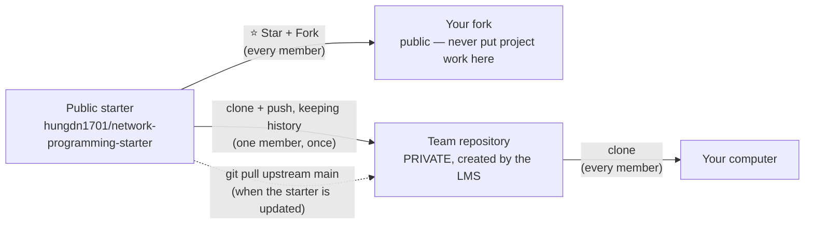

# Student Guide — Read This First

[](https://github.com/hungdn1701/network-programming-starter/stargazers)
[](https://github.com/hungdn1701/network-programming-starter/forks)

> **Course:** Network Programming (INT1433) · PTIT · Instructor: Dr. Hung N. Dang
>
> Follow this guide **in order** before you write any code. It takes about 30–60 minutes the first time.
> Rules and grading are in [`INSTRUCTION.md`](../INSTRUCTION.md); day-to-day development is in
> [`GETTING_STARTED.md`](../GETTING_STARTED.md).

---

## How the repositories fit together



- The **public starter** is the template, maintained by the instructor.
- **Your fork** is your bookmark of the starter. Leave it untouched.
- The **team repository** is where all your work goes. It is private and it is what gets graded.

---

## Step 1 — GitHub account and Git identity

1. Use **one** GitHub account for the whole course (create one at https://github.com/signup if needed).
   Set your real name in your GitHub profile so the instructor can recognise you.
2. Tell Git who you are — use the **same email as your GitHub account**, otherwise your commits are not linked to
   you and do not count as evidence of your contribution:

```bash
git config --global user.name  "Your Full Name"
git config --global user.email "the-email-on-your-github-account@example.com"
```

---

## Step 2 — Install the tools

| Tool | Needed for | Install | Check |
|------|-----------|---------|-------|
| Git | everything | https://git-scm.com/downloads | `git --version` |
| Docker Desktop (includes Compose v2) | runs the server and clients | https://docs.docker.com/get-docker/ | `docker compose version` |
| The language you will use (optional) | running code natively | e.g., JDK, Python, GCC, Node.js, Go | — |

> On Windows, start Docker Desktop and wait for the 🐳 icon before running `docker` commands; use Git Bash or
> PowerShell for the commands in this guide.

---

## Step 3 — Star and fork the starter (every member)

1. Open https://github.com/hungdn1701/network-programming-starter
2. Click **⭐ Star**.
3. Click **Fork** → owner: your personal account → **Create fork**.

You now have `https://github.com/<your-username>/network-programming-starter`. It is public: **do not commit project work to it**.
Use **Sync fork** on its page whenever you want to see the latest starter.

---

## Step 4 — Set up the team repository

1. **Create or join your team on the LMS** (max 3 members). When the team is created, the LMS creates an
   **empty private repository** for it in the course organization and sends each member a GitHub invitation.
2. **Every member accepts the invitation** — from the email GitHub sends, or at https://github.com/notifications
   (organization invitations also appear at `https://github.com/<course-org>`). Without accepting, you cannot
   see or push to the repository.
3. **One member, once,** copies the starter into the empty repository **with its history**:

```bash
git clone https://github.com/hungdn1701/network-programming-starter.git <team-repo>
cd <team-repo>
git remote rename origin upstream                                  # the starter, for updates
git remote add origin https://github.com/<course-org>/<team-repo>.git
git push -u origin main
```

> Not comfortable with the command line? Do this step together with a teammate — it is only five commands, and
> everyone else simply clones the result in Step 5.

Do **not** add a README, license or any other file to the team repository before this step — the push needs it to be empty.

---

## Step 5 — Clone and run (every member)

```bash
git clone https://github.com/<course-org>/<team-repo>.git
cd <team-repo>
git remote add upstream https://github.com/hungdn1701/network-programming-starter.git   # skip if you did Step 4 yourself
```

Then check that everything starts:

```bash
make init        # creates .env (or: cp .env.example .env)
make up          # builds and starts the server container
docker compose ps
```

The server is only a placeholder until your team chooses a language — see
[`GETTING_STARTED.md` §4](../GETTING_STARTED.md#4-choose-a-language--dockerfile-examples).

---

## Step 6 — First contribution

1. Create a branch: `git checkout -b docs/team-info`
2. Fill in the **Team** table and **Problem & Idea** in [`README.md`](../README.md).
3. Commit and push:

```bash
git add README.md
git commit -m "docs: add team info"
git push -u origin docs/team-info
```

4. Open a **Pull Request** to `main` on GitHub, ask a teammate to review it, then merge.

From now on, work the same way: **one branch per task → pull request → review → merge**.
Every member commits from their own account — your commits and pull requests are the evidence of your contribution.

---

## Step 7 — Getting starter updates

When the instructor announces a new starter version (the **Version** line at the top of `INSTRUCTION.md`):

```bash
git checkout main
git pull origin main
git pull upstream main     # merge the starter changes; resolve conflicts if any
git push origin main
```

Keep the `LICENSE` file and the "Based on …" line at the bottom of `README.md`.

---

## What to read next

| Order | Document | Why |
|:-----:|----------|-----|
| 1 | [`INSTRUCTION.md`](../INSTRUCTION.md) | Requirements, milestones, grading, AI policy, oral defense |
| 2 | [`GETTING_STARTED.md`](../GETTING_STARTED.md) | Running the project, workflow by milestone, submission checklist |
| 3 | [`docs/proposal.md`](proposal.md) | Your first deliverable (M1) |
| 4 | [`.ai/ai-guide.md`](../.ai/ai-guide.md) | Using AI assistants without failing the oral defense |
| 5 | [`docs/ai-log.md`](ai-log.md) | Where you record AI use — start from day one |

---

## Common Problems

| Problem | Cause | Fix |
|---------|-------|-----|
| `Permission denied` / `403` when pushing | Invitation not accepted, or no write access | Accept the invitation; if it persists, contact the instructor via the LMS |
| `git push` rejected later in the project | Teammates pushed before you | `git pull --rebase`, then push again |
| `Repository not found` | Wrong URL, or you have not accepted the invitation yet | Check the URL from the LMS; accept the invitation (email or https://github.com/notifications) |
| `! [rejected] main -> main (fetch first)` on the first push | The team repository is not empty (e.g., someone added a README) | Ask the instructor to reset it, or `git pull origin main --allow-unrelated-histories`, resolve, push |
| Commits show a different or unknown author | `user.email` does not match your GitHub account | Redo Step 1; fix future commits from then on |
| `Cannot connect to the Docker daemon` | Docker Desktop is not running | Start Docker Desktop and wait until it is ready |
| `port is already allocated` | Another program uses the port (e.g., 5000) | Stop that program, or change the port in `.env` |
| Project work pushed to your **public fork** by mistake | Wrong remote | Push it to the team repository, then delete the fork (Settings → Delete) and fork again; tell the instructor |

> Still stuck? Ask your team first, then the instructor through the LMS. Include the command you ran and the full
> error message.
